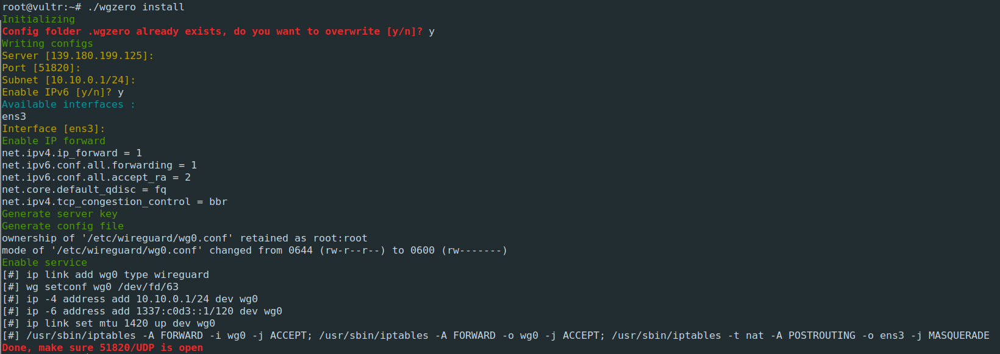
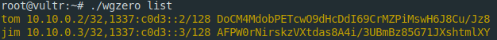

# WGZero
Zero overhead wireguard setup. Tested on Debian 10.

# Requirements
- [wireguard](https://www.wireguard.com/install/)
- curl
- qrencode
- iptables
- ipcalc

# Installation
```bash
curl -sO https://raw.githubusercontent.com/finzzz/wgzero/0.1/wgzero     # stable version
curl -sO https://raw.githubusercontent.com/finzzz/wgzero/master/wgzero  # latest version

chmod +x wgzero
./wgzero install
```




# Other Commands
```
wgzero list
wgzero add clientname
wgzero del clientname
wgzero qr clientname
```



# Troubleshoot
- Initial steps on debian
```bash
echo "deb http://deb.debian.org/debian buster-backports main" >> /etc/apt/sources.list
apt update && apt upgrade
apt install linux-headers-$(uname -r) wireguard qrencode ipcalc curl iptables
# replace linux-headers-$(uname -r) with linux-headers-amd64 if errors
```
- Running alongside Pihole  
Run `pihole restartdns` after setup
