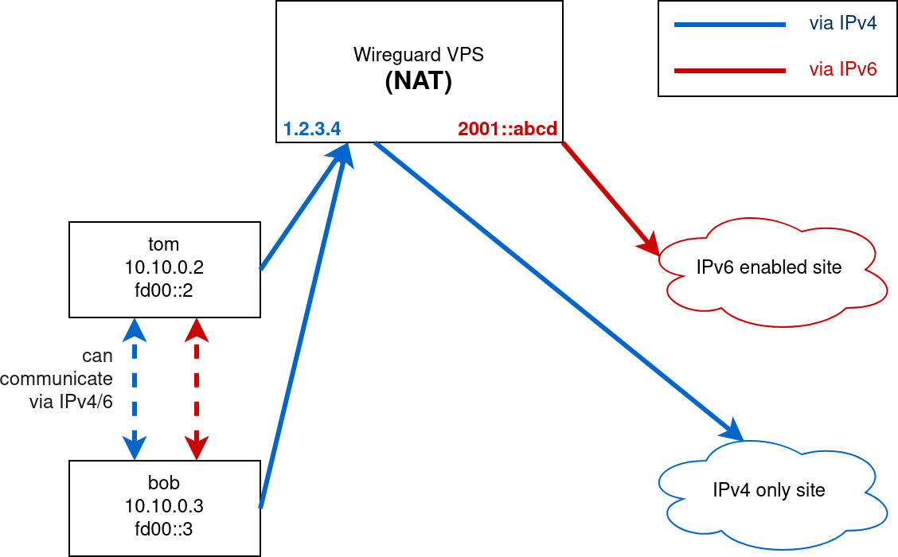

# WGZero
Zero overhead wireguard setup. Tested on Debian 10.

# Requirements
- [wireguard](https://www.wireguard.com/install/)
- curl
- qrencode
- iptables
- ipcalc

# IPv6
Please make sure you can connect to ipv6 address
```
root@localhost:~# ping6 -c 3 google.com
PING google.com(nrt20s02-in-x0e.1e100.net (2404:6800:4004:809::200e)) 56 data bytes
64 bytes from nrt20s02-in-x0e.1e100.net (2404:6800:4004:809::200e): icmp_seq=1 ttl=121 time=0.702 ms
64 bytes from nrt20s02-in-x0e.1e100.net (2404:6800:4004:809::200e): icmp_seq=2 ttl=121 time=0.810 ms
64 bytes from nrt20s02-in-x0e.1e100.net (2404:6800:4004:809::200e): icmp_seq=3 ttl=121 time=0.751 ms

--- google.com ping statistics ---
3 packets transmitted, 3 received, 0% packet loss, time 15ms
rtt min/avg/max/mdev = 0.702/0.754/0.810/0.049 ms
```

There are 2 types of connection (check your IP using `ip -6 a`):
## NAT
- public IPv6 is being shared, and internal IPv6 uses ULA
- you need to have IPv6 address similar to `2001::a:b:c:d/64`


## SLAAC (still has bugs)
- assign public IPv6 to each clients
- you need to have IPv6 address similar to `2001:a:b:c::/64`
    - notice the colons, it means that you can assign multiple addresses to clients
    - not every providers provide this, some require opening a ticket (linode provides this, not sponsoring though...)
- make sure you have configuration `/etc/network/interfaces` similar to this
```
iface eth0 inet6 static
    address 2001:a:b:c::/64
    gateway fe80::1
```


# Installation
```bash
curl -sO https://raw.githubusercontent.com/finzzz/wgzero/master/wgzero

chmod +x wgzero
./wgzero install
```


# Other Commands
```
wgzero list
wgzero add clientname
wgzero del clientname
wgzero qr clientname
```

# FAQ, troubleshoot, etc.
- Initial steps on debian
```bash
echo "deb http://deb.debian.org/debian buster-backports main" >> /etc/apt/sources.list
apt update && apt upgrade
apt install linux-headers-$(uname -r) wireguard qrencode ipcalc curl iptables jq
# replace linux-headers-$(uname -r) with linux-headers-amd64 if errors
```

- Running alongside Pihole  
Run `pihole restartdns` after setup